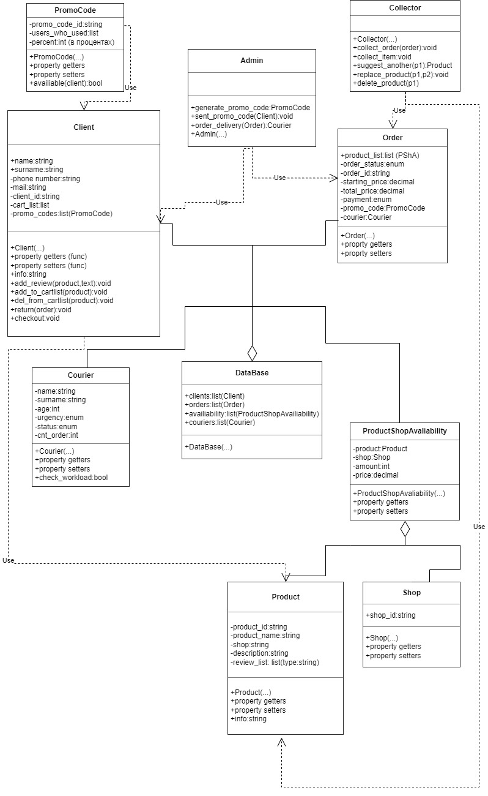

# Доставка товаров из магазина
## Примеры
* Лента
* Метро
* Самокат
## Классы
* Клиент
* Заказ
* Промокод
* Коллектор
* Админ
* Курьер
* База данных
* Зависимость продукт-магазин
* Продукт
* Магазин
## Процессы
* Выбор магазина (клиент, продукт-магазин)
* Поиск товара (клиент, продукт-магазин)
* Просмотр характеристик/отзывов (клиент, продукт-магазин, продукт)
* Добавление в корзину (клиент, товар)
* Убрать из корзины (клиент, товар)
* Оформить заказ (клиент, заказ, товар) Здесь же происходит 
выбор способа оплаты, применение промокода
* Сбор заказа, проверка наличия (сборщик,заказ, клиент)
* Доставка (курьер, база данных, заказ, админ)
* Отмена заказа (заказ, клиент)
* Оставить отзыв (товар, клиент)
* Раздача промокодов (админ, клиент)
## Схема

